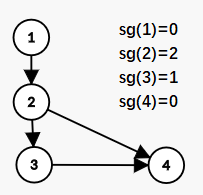

# 目录
* 背景
* 一些资料
* 平等组合游戏
  * 约定
  * Min-Max
  * NIM
    * NIM问题描述
    * 结论
    * 证明
  * SG函数
    * 定义及约定
    * 有向图上的平等组合问题的定理
    * 证明
  * NIM问题若干拓展
    * anti-NIM
    * 阶梯NIM
    * NIM-K
* 完全信息静态博弈
  * 约定
  * 纳什均衡
    * 纯策略纳什均衡
    * 混合策略纳什均衡
    * 单纯形法

# 背景
本人长期徘徊于弥补多项式短板/写字符串爽题/码毒瘤数据结构/看数学书这四件奇怪的事情上，因此水平很菜。

以前接触过一点简单的博弈论，但那实在是太简单了，就是对抗搜索（Min-Max）。

近期训练，做到了一道 SAMParent-Tree 上倍增之后博弈的题目， SAM 都码完了，一看那个博弈，越看越慌，发现自己根本不会：何止不会，一分都拿不到。

于是开始恶补博弈论，发现很妙，但是挺好理解的。

本文因为作者被作业抓走了，暂时没有完成纳什均衡的内容。

本文中的 ^ 和 xor 和 $\oplus$ 如无特殊说明，均表示二进制下按位异或运算。

本文中一般来说，$\mathrm{sg}(a)$ 用于表示有向图上的单个状态 $a$ 的SG函数值，$\mathrm{SG}(A)$ 用于表示有向图上一组状态 $A=\{a_i\}$ 的SG函数值。但是不排除有的地方可能使用混乱。

update：发现那道促使我学习博弈论的题目是道假题，具体可以看我在anti-NIM里的内容

update：又发现了一个“经典”的错误拓展（就是我做到假题了，最近还一连做到了两道假题）。就是NIM-K实际上也是不能随意拓展的。

# 一些资料
[oi-wiki](https://oi-wiki.org/math/game-theory/) 基本可以博弈论入门了

[SG函数入门及例题](https://blog.csdn.net/strangedbly/article/details/51137432) 这篇文章良心

[anti-NIM问题入门](https://blog.csdn.net/qq_21120027/article/details/47839999) 很短，anti-NIM建议把SG搞懂之后作为一个应用加深了解，但是他证明有点问题。

[纳什均衡的一个例子](https://blog.csdn.net/Mys_C_K/article/details/85263387) 初步演示纳什均衡在OI中的用法

[纳什均衡/划线法](https://blog.csdn.net/qq_39742013/article/details/81738499) 这篇文章我弄出来，只是为了说明划线法傻得不得了

[纳什均衡/靠谱计算方法](https://blog.csdn.net/qq_42876636/article/details/93347553) 个人认为是比较靠谱的纳什均衡计算方法（疯狂diss划线法）

[纳什均衡/混合策略](https://blog.csdn.net/stonesharp/article/details/51740879) （FBI Warning）这玩意儿太神仙了，个人计划如果有时间找一本博弈论的书来学习这一块内容，但讲道理OI里面大概是不会出现这种东西的（搞个纳什均衡出来就不错了）。

[纳什均衡/生动例子（雾](https://www.bilibili.com/read/cv21615) ~~这可是我太爷爷的太爷爷关注的up主[doge]手动滑稽~~

相信大家看出来了，我不想写纳什均衡，于是资料收集了很多。

# 平等组合游戏

## 一些定义、约定及基本规律
* 平等组合游戏（不严谨）
  * 两个人参与，且一胜一负
  * 每个人面对所有局面的可能选择都是一样的
  * 游戏总能结束，即，可以把所有状态抽象成点，选择抽象成边，游戏会变成$DAG$
  * 一般而言不能操作者输（不能操作者赢就是anti-NIM问题）

* N-position&P-position
  * 对于一个状态，如果当前获得这个状态的人能获胜，则称之为N-position（Now）
  * 对于一个状态，如果前一个状态转移过来的人能获胜，则称之为P-position（Pre）

* 如果一个状态是N-position，则他一定可以转移到一个P-position
* 如果一个状态是P-position，则他的所有转移都一定指向N-position

## Min-Max搜索

### 作用及简介
就是搜索平等组合游戏最暴力的方法，你能用这个方法得出几乎所有这类问题的~~指数级暴力~~算法

很基础，所以也没什么好讲的。

### 大致流程
先抽象状态，然后写暴力从题目给定的初始状态出发，用基本事实以及边界条件判断每个状态是N还是P。

因此，记忆化搜索是常用的。

可以结合这样一个问题来理解这个过程：

* Alice和Bob在做游戏，这个游戏是在一个 $n\times n$ 棋盘上进行的，棋盘中每个格子都有一定的金币，Alice和Bob轮流操控一枚初始时在棋盘左上角的棋子，每人每次移动一格，并收集目标格子里的金币（重复经过可重复收集），每轮Alice移动一次之后Bob移动一次，共移动$m$轮。
* 因为Alice是mhw，所以所有金币全部归她，而Bob会一无所有。自然地，Alice希望最大化收集到的金币数，而Bob则希望最小化这个数值。
* 给出棋盘大小，每个格子里的金币数，进行的轮数，求最终Alice可以获得多少金币。

（原创题，但是也许比较经典，会在什么地方有类似的题目）
## NIM问题
这几乎是博弈论里面最经典的问题了。后文的SG函数以及anti-NIM问题的理解基本都要以其作为基础。

### NIM问题描述
现在你有 $n$ 堆石子，第 $i$ 堆石子有 $a_i$ 个。两个人轮流进行游戏，每次可以从任意一堆中拿走任意数量的石子，但不能不拿，不能行动的人就输了。问是先手必胜还是后手。

### 结论
先手能获胜，当且仅当 $a_1\oplus a_2\oplus a_3\oplus ... \oplus a_n\neq0$

换言之，就是一个状态异或和不为0就是N-position，一个状态异或和为0就是P-position

### 证明
* 最终获胜者的最后一步操作，在异或和上的体现，就是从非0变成了0。

* 接下来，只要证明有这样一种方法，使得非0的异或和减去一个数字之后异或和就能变成0。

* 设当前异或和为 $k$ 且 $\mathrm{highbit}(k)=d$（ $\mathrm{highbit}(k)=d$ 表示 $k$ 在二进制下最高位为第 $d$ 位），则必有 $a_i$ 第 $d$ 位是1。我们将这个 $a_i$ 变为 $a_i^{\prime}=a_i\oplus k$
* 考虑到 $k$ 与 $a_i$ 在第 $d$ 位上都为1，因此 $a_i^{\prime}$ 在第 $d$ 位上为0，因此 $a_i^{\prime}<a_i$ ，移动合法。
* 而对方在拿到了一个异或和为0的状态之后，不论怎么移动，移动完异或和必定不为0

我们就给出了一个构造性的证明。

## SG函数
### 定义及约定
* 我们假定这样一种游戏模型：一张$DAG$上选择了$n$个点$a_1,a_2,a_3,...,a_n$，每次操作者可以选择一个点，沿着这张$DAG$的一条边走一步，不能走的人就输了，问先手胜还是后手胜。
* $mex(S)=\min\limits_{n\in N,n\notin S}{n}$，就是不在集合$S$中的最小非负整数。
* $sg(x)=mex\left(\left\{sg(y)|x\rightarrow y\right\}\right)$，其中$x\rightarrow y$这个表达可能不正规，是状态$x$可以转移到状态$y$的意思。
* 我们称一个游戏在$A=\{a_1,a_2,...,a_n\}$这个初始状态下的$SG(A)$为$sg(a_i)$的异或和。

### 有向图上的平等组合问题的定理
一个状态$A$是N-position（先手获胜），当且仅当$SG(A)\neq0$

### 证明
我们发现这个东西真的与NIM问题很像。

* 考虑$DAG$上没有出边的点，其$sg$一定为0，而一个人输了，就是他拿到的状态里所有的点都没有出边。因此此时这个状态$SG=0$，是P-position。
* 考虑一个点$a$，如果$sg(a)=k$，则他能转移到的状态b中，一定有$sg(b)=0,sg(b)=1,...sg(b)=k-1$的，这一点与NIM问题很像，因为NIM中，我们也可以把一堆$k$个的石子变成$0,1,2,...,k-1$个中的任意一个。
* 那么，当我们遇到一个$SG(A)\neq0$的状态的时候，我们可以把$sg$的值的大小看作这一堆的石子数，借用上面NIM问题的方法，把状态$a_i|highbit(sg(a))=highbit(SG(A))$，变为状态$a_i'$使得$sg(a_i')=sg(a_i)$ ^ $SG(A)$即可。
* 同样的，一个$SG(A)=0$的状态，进行一步改变，$SG(A^{\prime})$是一定会不等于0的。

## NIM问题若干拓展

### anti-NIM
注意anti-NIM问题的结论只有在取石子游戏或者具有某种特殊性质的$SG$函数中才成立。那道促使我学习博弈论的题目就是因为其误用了anti-NIM的结论，将其错误地推广至一般情况。

#### 取石子游戏
##### 描述
其他条件都和一般的NIM游戏一样，只是判定胜利的条件变成了不能走的人是赢家。

##### 定理

对于一个状态$A=\{a_1,a_2,...,a_n\}$：
* 若$\max sg(a_i)\leq 1$，则其为N-position当且仅当$SG(A)=0$
* 若$\max sg(a_i)>1$，则其为N-position当且仅当$SG(A)\neq0$

其中$a_i$表示第$i$堆石子的个数；在这个问题里，$sg(a_i)=a_i$

##### 证明
* $\max sg(a_i)>1$ (Case1)
  * 若$SG(A)\neq0$ (Case1.1)
    * 当有多个$sg(a_i)>1$时 (Case1.1.1)
    与$SG$函数里的证明差不多，我们总能将$A$变为$A'$使得$SG(A')=0$
    * 当只有一个$sg(a_i)>1$时 (Case1.1.2)
    我们发现修改后会造成$\max sg(a_i)\leq1$，我们应当使得$SG(A')$不为0。假设我们沿用原来的方法，求得$a_i$应变为$a_i'$，则我们实际应将之变为$a_i''$使得$sg(a_i'')=sg(a_i')$ ^ $1$。此时易知$sg(a_i'')\in\{0,1\}$，因此我们就成功转移到了一个P-position，并且$a_i\rightarrow a_i''$是合法的转移
  * 若$SG(A)=0$(Case1.2)
    * 此时一定有超过1个$sg(a_i)>1$，因此$SG$函数那里的讨论依然适用。 (Case1.2.1)
* $\max sg(a_i)\leq1$(Case2)
  * 若$SG(A)=0$(Case2.1)
    * 若存在$sg(a_i)=1$，将之变为0即可 (Case2.1.1)
    * 若不存在$sg(a_i)=1$，即所有$sg(a_i)$都是0，我们发现这就是结束状态。 (Case2.1.2)
  * 若$SG(A)\neq0$，即$SG(A)=1$(Case2.2)
    * 要么在0和1之间改动，使得$\max sg(a_i)\leq1$且$SG(A')=0$ (Case2.2.1)
    * 要么将一个数$a_i$改动至$a_i'$使得$sg(a_i')>1$，此时$\max sg(a_i)>1$且$SG(A')\neq0$ (Case2.2.2)

此处做详细证明，是为了后文说明方便。

#### 推广

##### 一个错误推广
/*一点唠叨 *\\
既然，普通的NIM问题可以推广到一般的SG函数，那么，anti-NIM直觉上也是可以的。

而且你稍微想一下，会觉得如果把$sg$值看作石子个数，那么根据上文的证明，这就是成立的。

但是，事实真的与我们的直觉一致吗？

这可是反直觉的博弈论诶。

我曾经也以为这个直觉是对的，直到我详细写出了证明。
\\*唠叨结束 */

* 我们定义一个anti-SG问题一般形式为：初始时，在一张$DAG$上放置了$n$个点，双方轮流行动，最终不能行动的一方获胜，给定$DAG$与初始条件，求是先手必胜还是后手必胜。
* 错误地推广来的结论：anti-SG问题中，先手必胜的条件与取石子游戏相同。

##### 错误性证明
* 在anti-NIM的分类讨论里面，我们逐条分析，发现除了(Case2.1.2)，其他都是对的。
（在证明中我特意把所有的石子个数都写成了$sg(a_i)$，就是为了现在不用再写一遍）
* (Case2.1.2)的条件是：所有$sg(a_i)$都为0。在取石子游戏中，我们发现这就是终止状态了，但是在一般的$DAG$中，并不是这样的。有可能非终止节点的$sg$也为0。此时，我们发现只要你进行转移，$SG(A')$就一定不为0。
  * 如果转移后的$sg(a_i')=1$，则根据要证明的结论，我们转移至一个P-position，还是可以的。
  * 如果转移后的$sg(a_i')>1$，则根据要证明的结论，我们转移至一个N-position，这就不行了。
* 事情就出在这里，你不能保证一定可以转移到一个$sg(a_i')=1$的节点。
* 由于我们这是一个数学归纳的过程，这一步的结论出错，其他所有结论就都错了，几乎无法挽救。

##### 一个反例
这里给出一个反例，以说明我没有在说瞎话。

考虑有向图：$1\rightarrow2\qquad2\rightarrow3\qquad3\rightarrow4\qquad2\rightarrow4$

即：

##### 一道错题
就是那道促使我学习博弈论的题目：

【题面】
* 给出一个由小写英文字母构成的字符串$S$,再取$n$个字符串,它们都是$S$的子串,之后开始游戏,两人轮流操作:
  * 每次选一个串,在其后添加一个英文字母,保证添加后该串仍为$S$的子串。

* 谁不能操作谁输,或者谁不能操作谁胜（这是两种询问）。

【题解】（误
* 我们发现，这就是在SAM上作一般的SG游戏以及anti-SG游戏。
* 那么，第一种询问就可以随便完成，第二种询问就是假的，不可作。

##### 推广的补救方法
我们发现，证明告诉我们，错误的原因时$sg(a_i')$不一定可以为1。那么，如果我们在条件当中加入一条：
* 保证所有$sg=0$节点，要么是终止节点，要么一定可以转移到$sg=1$的节点

就可以了。

##### 推广的另一补救方法
我们发现，可以修改问题本身，令获胜条件就是所有$sg(a_i)$全部都是0。

我翻资料的时候发现在网络上对于这个问题有一个名字：SJ。大致来源于2009年贾志豪的一篇论文《组合游戏略述——浅谈SG游戏的若干拓展及变形》。

### 阶梯NIM

#### 描述
有$n$堆石子，依次标号为1至$n$，其中第$i$堆有$a_i$个石子。每次玩家可以选择一个至少有一个石子的石子堆第$i$堆，从中拿出至少一个移动到第$i-1$堆中。移动到第0堆中被视为移出游戏。不能操作者输。

#### 结论
记当前局面为$A$。记$status(A)$为编号为奇数的那些石子堆的石子数的异或和。若$status(A)=0$，先手必败，否则必胜。

#### 证明
* 我们记操作之前的序列为$a_i$，操作完了之后为$a_i'$
* 首先，不能移动，意味着我们没有石子了，那异或和天然为0。初始条件没问题。
* 证明对于一个$status(A)=0$的状态，我们经过一步操作之后$status(A')\neq 0$。
  * 因为我们一步操作要么改变$a_1$的值，要么改变$a_i$和$a_{i+1}$的值。这就意味着我们编号为奇数的那些堆只会有一个的石子个数发生变化。
  * 既然只有一个发生变化，我们记这个位置编号为$x$，我们显然有$status(A')=status(A)\mathop{xor}a_x\mathop{xor}a_x'$。因为$status(A)=0,a_x\neq a_x'$，所以$status(A')\neq 0$。
* 之后证明对于一个$status(A)\neq 0$的状态，我们经过一步操作之后可以做到$status(A')=0$
  * 我们称当前这个局面$A$的对应NIM问题$NIM(A)$为把那些编号为奇数的石子堆单独拿出来进行的一个普通NIM游戏。有$status(A)=SG(NIM(A))$
  * 而我们可以通过将某一堆编号为奇数的石子堆的石子移动到前面一堆中，来实现将$NIM(A)$中任意一堆石子中取走任意多个。
  * 因为$NIM(A)$是可以通过取走一定量的石子来使得$SG(NIM(A'))=0$，所以我们可以使$status(A')=0$。
* update20210717: 我觉得很奇怪，因为用类似上面的证明，应该是可以说明$status$就是这个游戏的$SG$函数的。不是很清楚我当时在干什么。

### NIM-K

#### 描述

有$n$堆石子，第$i$堆$a_i$个。双方轮流从中挑选不超过$k$堆取石子，每堆可以取任意个，但是每次至少取一个石子。不能取石子者输。

#### 结论

记$a_i$在二进制下第$j$位为$a_i(j)$，我们考察$status=\sum_{j\geq 0}(\sum_{i=1}^{n}a_i(j)\mod (k+1))$。若其为0，则先手必输，否则必胜。

#### 简要证明

* 首先，证明如果你拿到一个$status=0$的局面，你经过操作后不可能让$status$保持0。
  * 记操作前为$a_i$，操作后为$a_i'$。记$highbit(x)$表示$x$(k+1)进制下最高的那一位的指数。记$h=\max highbit(a_i \mathop{xor} a_i')$。记$f'(h)=\sum_{i=1}^n a_i'(h),f(h)=\sum_{i=1}^n a_i(h)$。(注意在这里我们的$xor$定义为(k+1)进制下的不进位加法。)
  * 我们发现有$0<f(h)-f'(h)<k+1$。前面一个小于号成立基于$a_i\geq a_i'$。后面一个小于号成立基于我们每次操作只会改动最多$k$个，并且$h$为被改动的最高位。具体就不展开了。
* 然后，证明如果你拿到一个$status\neq 0$的局面，你一定可以通过改变不超过$k$个数使得$status$变为0。
  * 记操作前为$a_i$，操作中为$a_i'$。记$f'(h)=\sum_{i=1}^n a_i'(h)$。
  * 我们从所有数字的最高位开始一位一位往下看，在一些位上使用一些改变机会。
  * 假设当前我们看到第$x$位，还有$m$个改变机会没有确定给。
  * 若$f'(x)\mod (k+1)\leq m$，我们会从二进制下第$x$位为1的数字中挑选$f'(x)\mod(k+1)$个来赋予改变机会，并先将他们的第$0$到第$x$位都变成零。
  * 若$f'(x)\mod (k+1)> m$，我们将从此前修改过的$k-m$个数字中，挑选$k+1-(f'(x)\mod(k+1))$个，将其二进制下第$x$位变成1。因为$k+1-(f'(x)\mod(k+1))\leq k-m$，所以我们一定可以成功。

#### 一个简单的错误推广及其错误原因说明

* 推广：我们猜测任意一组有向图上的游戏，如果每次移动k个，可以使用NIM-K的结论，即考察每个点的sg值在二进制下每一位的和对$m+1$取模的结果的和是否为0来决定是否先手必胜。
* 但是很遗憾，这是错的。考虑上面的简要证明，我们发现问题在于$sg$可能小于$sg'$，从而导致我们拿到一个$status=0$的局面，有可能保持其为0。
* 一个简单的例子：$k=2,sg(1)=1,sg(2)=1,sg(3)=1,sg(4)=0$，此时$status=0$。我们可能可以将其变为$sg(1)=1,sg(2)=1,sg(3)=0,sg(4)=1$。这个局面的$status=0$。因此$status$就不能作为局面是否先手必胜的判断条件了。
* 注意到这个错误推广告诉我们阶梯NIM问题是不能推广到每次移动不超过k个阶梯上的石子，也不能推广到每次任意移动不超过k个石子。问题就在于阶梯NIM的$sg=0$的状态基本都能转移到$sg=1$的状态。

# 完全信息静态博弈

## 定义
* 就是若干方博弈，所有人能做出的选择，每种选择带来的收益等一切信息所有人都知道

## 纳什均衡
### 概述
其实有四种纳什均衡：严格占优纳什均衡、重复剔除的占优策略均衡、纯策略纳什均衡、混合策略纳什均衡。

这四种是包含关系：严格占优纳什均衡<重复剔除的占优策略均衡<纯策略纳什均衡<混合策略纳什均衡

但是前两种本人不太了解，而且我认为纯策略纳什均衡已经比较容易理解了，所以我从第三个写起。

### 低阶版本-纯策略纳什均衡

#### 定义
我们发现，如果现在有$n$个人在博弈，而且其中$n-1$个人的决策都确定了，则最后一个人有若干确定的最优决策和一个最大收益。

我们记一个局面$S=\{s_1,s_2,...,s_n\}$，其中$s_i$表示第$i$个人的决策。

我们为了方便，记$u_{S,i}$表示在局面$S$下第$i$个人的收益。（这个记法不正规，但是正规的有点烦）

由此，我们称一个局面$S=\{s_1,s_2,...,s_i,...,s_n\}$为纳什均衡当且仅当：
* 对于每一个人$i$，都不存在$S'={\{s_1,s_2,...,s_i',...,s_n\}}$使得$u_{S',i}>u_{S,i}$
* 换而言之，就是每个人在其他人决策不变的情况下，都取到了可能的最佳结果。

#### 举个栗子
* 现在有JSOI王国（简称J）正在和SAO（简称S）王国战略对峙，双方都初步掌握了卡常技巧，但是世界上其他人全都不会卡常，因此他们就取得了巨大优势，所有人都打不过它们，他们因此不受任何人的管束，可以随意瞎搞。
* 他们发展了一段时间卡常技巧之后，感觉这个东西太毒瘤了，一旦互相出题出的全是卡常题，事情将会一发不可收拾。他们一致决定相互协商，禁止卡常技术的继续研究发展。
* 但是考虑到如果自己老老实实地停止发展，但是对方悄密密地继续，自己就会打不过对方。而且，如果自己不遵守，对方也无计可施。因此，他们就决定劝说对方禁止，反正自己不禁止。
* 于是，他们继续发展卡常技术。此时双方就达成了一种纳什均衡状态。
* 也就是说，双方都有两种选择：发展/不发展。但是不管对方是什么选择，自己永远是选择发展可以获得更大的利益，因此双方在追求利益最大化的过程中都会作出这种选择。

一个更加正常的例子，可以看[这里](https://www.bilibili.com/read/cv21615)

#### 计算方法
##### 划线法
我认为这个方法有点蠢。

所以，我不想写。[看这里](https://blog.csdn.net/qq_39742013/article/details/81738499)

但是，不得不说，这个方法还是有可取之处的。他揭示了纳什均衡的本质，让人能够看出来纳什均衡究竟在什么时候会出现。这实际上为其它的解法奠定了基础。而且他让你能手算小模型的纳什均衡。

##### 求函数交点
参考博客：[纳什均衡/靠谱计算方法](https://blog.csdn.net/qq_42876636/article/details/93347553)

### 高阶版本-混合策略纳什均衡

#### 混合策略

* 混合策略大致解释：每个决策概率进行，决定决策实际是决定每个决策的进行概率。此时的纳什均衡就是对于每个人，其他所有人的决策固定，此时自己的决定的期望收益最大。
* 比较数学化的表述：对于一个人他有纯策略策略： $S=\{s_1,s_2,...,s_n\}$
我们再记一个概率向量$X=(x_1,x_2,...,x_n)$表示其概率选择。
即，这个人选择$s_1$策略的概率是$x_1$，选择$s_2$策略的概率是$x_2$，...，选择$s_n$策略的概率是$x_n$
那么，我们就称$X$是这个人的一个混合策略。
* 这种情况下的纳什均衡在理解上是与纯策略相同的，只不过其中的策略是纯策略的扩展。

#### 混合策略的意义
很多事情是没有（纯策略的）纳什均衡的（比如石头剪刀布）

但是，如果你把每种决策的概率考虑进去来构成策略，他就有纳什均衡了。

事实上，这会更加贴近现实生活。

#### 单纯形法

为什么单纯形法能做？因为你考虑单纯形法的过程，就是每次选一维去调整（对应于一个人在其他人确定策略的情况下调整策略），那这调整不动就天然符合了纳什均衡的定义。

我就不写了。推荐大家去看OI-wiki（虽然上面写得有点乱，但是我能看懂，说明是人力所能为的）。
